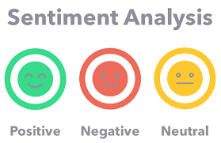

# Husani Newbold's Data Science Portfolio

Welcome to my data science portfolio! Here you will find a growing selection of my personal machine learning projects.

In addition, you can use the links below to connect with me on LinkedIn, view my data visualization portfolio on Tableau Public, or see my official certifications on Credly. For a complete list along with copies of my certifications, please see the 'certifications' section of my [LinkedIn](https://www.linkedin.com/in/hnew/).

## Featured Projects

### 1. Predicting Employee Attrition with Deep Learning: An Artificial Neural Network (ANN) Approach using TensorFlow
This project utilizes a deep learning model, specifically an Artificial Neural Network (ANN), to predict whether an employee will leave a company based on common work-related attributes such as tenure, salary level, and work hours. Furthermore, Keras Tuner was used to efficiently find the best hyperparameters for the model. This process demonstrated the capability of deep learning models to make accurate predictions based on a limited set of variables, proving the effectiveness of careful tuning and model selection.

[Explore the project on GitHub](https://github.com/hnewbold/employee-attrition-ann)

### 2. Hotel Review Sentiment Analysis with Large Language Models (LLM): Leveraging BERT in TensorFlow
This project analyzes the sentiment of hotel reviews using advanced Natural Language Processing (NLP) techniques. The reviews are cleaned using the Natural Language Toolkit (nltk) to remove noise and standardize the text. A pre-trained BERT model, accessed through the Hugging Face Transformers library, is fine-tuned using the cleaned hotel review data. The result is a fine-tuned BERT model implemented in TensorFlow that can accurately predict the sentiment (positive, neutral, or negative) of hotel reviews. 

[Explore the project on GitHub](https://github.com/hnewbold/hotel_reviews_sentiment_analysis/)

### 3. Sales Time Series Analysis Using Facebook Prophet
This project utilizes Facebook's Prophet package, a robust time series forecasting tool, to predict weekly sales data for a Walmart store. By leveraging historical sales data and a few key independent variables, the model is able to provide highly accurate forecasts of future sales trends which can aid in better decision-making for strategic planning.

[Explore the project on GitHub](https://github.com/hnewbold/sales_time_series_forecast)

## About Me
Professional Data Scientist with an MSc in Applied Econometrics & Data Analytics. Over 5 years of combined corporate experience working as a Data Scientist and Data Analyst. Experienced in various areas including machine learning, data mining, data visualization, cloud technologies, and statistics. Certified in Python, Tableau, SAS and Azure AI & Cloud. 

## Additional Links
[LinkedIn](https://www.linkedin.com/in/hnew/) | [Tableau Public](https://public.tableau.com/app/profile/hnew/vizzes) | <a href="https://www.credly.com/users/husani-newbold" title="To view all certifications visit LinkedIn certification Section">Certifications</a>

